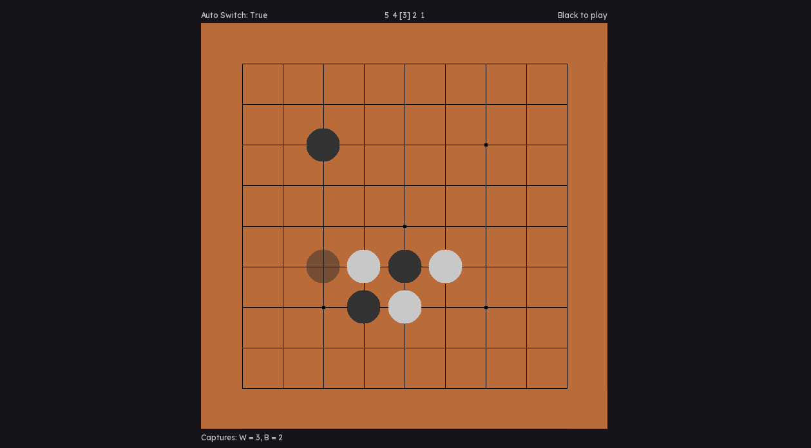
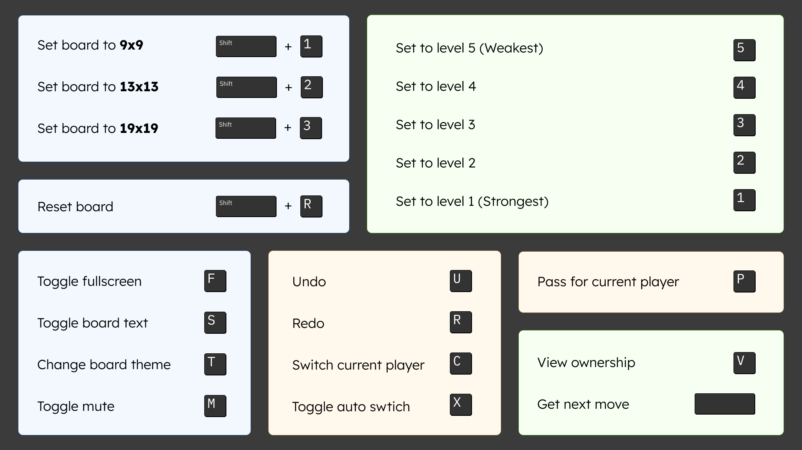

# Go Game Analyzer

A minimalistic Go game built using SDL3 with KataGo AI integration for game analysis and assistance.



## Table of Contents

- [Features](#features)
- [Key Bindings](#key-bindings)
- [Installation](#installation)
  - [Windows](#windows)
  - [Linux](#linux)
- [Configuration](#configuration)
  - [KataGo Setup](#katago-setup)
  - [Custom Themes](#custom-themes)
  - [Background Music](#background-music)
  - [KataGo Level Settings](#katago-level-settings)
- [Building from Source](#building-from-source)
  - [Requirements](#requirements)
  - [Linux Build](#linux-build)
  - [Windows Build (Cross-compilation)](#windows-build-cross-compilation)
- [Reporting Issues](#reporting-issues)
- [Future Plans](#future-plans)
- [Acknowledgments](#acknowledgments)

## Features

- **Multiple Board Sizes**: Support for 9x9, 13x13, and 19x19 boards
- **Intuitive Controls**: Keyboard-based controls for smooth gameplay
- **Move History**: Full undo and redo functionality
- **KataGo AI Integration**:
  - AI-powered move suggestions based on difficulty levels
  - Real-time board evaluation and analysis
- **Customization**:
  - Custom color themes support
  - Background music playback
- **Cross-Platform**: Available for Windows and Linux

## Key Bindings



## Installation

### Windows

The Windows build works out of the box for CPU usage. For optimal performance with GPU acceleration:

- **GPU (OpenCL)**: OpenCL drivers may be required
- **NVIDIA GPUs**: Download KataGo CUDA version and update the `config.json` path for better performance
- **Note**: CPU performance with higher `maxVisits` settings can be slow

### Linux

1. Download and extract the release archive
2. Install OpenCL if using GPU build
3. For NVIDIA GPUs, use KataGo CUDA build for better performance
4. Launch the game using the provided script:
   ```bash
   ./run.sh
   ```

## Configuration

### KataGo Setup

Edit the `config.json` file in the root directory:

```json
{
  "engine_enabled": true,
  "katago_path": "path/to/katago",
  "config_path": "assets/KataGo/config/analysis.cfg",
  "model_path": "path/to/model.bin.gz"
}
```

**Properties:**

- `engine_enabled` (Boolean): Enable/disable the KataGo engine
- `katago_path` (String): Path to KataGo executable
  - Windows format: `"C:\\path\\to\\katago\\katago.exe"`
- `config_path` (String): Path to the analysis configuration file (default provided in `assets/KataGo/config`)
- `model_path` (String): Path to the KataGo neural network model

### Custom Themes

Create custom themes by adding JSON files to `assets/themes/`. Use the `T` key to cycle through available themes.

**Theme JSON Properties:**

```json
{
  "background": "#HEXCODE",
  "board": "#HEXCODE",
  "board_line": "#HEXCODE",
  "black_piece": "#HEXCODE",
  "white_piece": "#HEXCODE",
  "text": "#HEXCODE",
  "text_error": "#HEXCODE",
  "hidden_board": false
}
```

- `hidden_board`: Set to `true` if board color matches background color

### Background Music

Add MP3 files to the `assets/music/` directory. All music files will be loaded at startup and played sequentially.

**Supported formats:** MP3 only

### KataGo Level Settings

Adjust AI difficulty by editing `assets/KataGo/config/settings.json`. Settings range from Level 1 (hardest) to Level 5 (easiest), plus evaluat
ion settings.

**Setting Properties:**

- `maxVisits`: Analysis depth (lower = faster response, less accurate)
- `rootPolicyTemperature`: Determinism level (lower = more serious play)
- `rootFpuReductionMax`: Move exploration eagerness (lower = more exploratory)

Settings are reloaded on each move, allowing real-time adjustments. If parsing fails, default hardcoded settings are used.

**Note:** Set evaluation settings to the highest your machine can handle for best analysis quality.

## Building from Source

Refer to `.github/workflows/build.yml` for the complete build process.

### Requirements

- SDL3 libraries in the `lib/` directory
- CMake
- C++ compiler (GCC/MinGW)

### Linux Build

```bash
mkdir build && cd build
cmake -DBUILD_TYPE=linux -DCONFIG_TYPE=linux_raw ..
cmake --build .
```

### Windows Build (Cross-compilation)

```bash
mkdir build-windows && cd build-windows
cmake -DBUILD_TYPE=windows -DCONFIG_TYPE=windows_raw \
  -DCMAKE_TOOLCHAIN_FILE=../scripts/mingw-w64-toolchain.cmake ..
cmake --build .
```

**Post-Build:** Download KataGo and a neural network model separately, then update `config.json` with their paths.

## Reporting Issues

When reporting bugs, please include:

- Your machine specifications
- Build version used (Windows/Linux, GPU/CPU)
- Steps to reproduce the issue
- Log files (if available)

**Note:** Current logging may not capture all edge cases. Detailed reproduction steps are essential.

## Development

Todo:
- ~~Compute board state after addAction~~
- ~~Use board state to check if stone is already added~~
- ~~Add GoBoardRuleManager to validate move (if stone can be added to the position)~~
- ~~Remove action: RemoveStones and add CaptureStones { GoStone, GoStone[] }, to know which stone addition caused the capture~~
- ~~Add undo and redo functionality using 'u' and 'r' key~~
- ~~Store captures info~~
- ~~Add functionality to pass for both turns (End game if both pass)~~
- ~~Display turn pass in UI~~
- ~~Connect to KataGo and evaluate board position~~
- ~~Use 'space' to get next best move (based on the turn)~~
- ~~Add multiple platform build solution in CMakeLists.txt~~
- ~~Use Github workflows to generate multiple releases for different platforms (Windows, Linux and MacOS)~~
- ~~Evaluate score (using katogo) and display it (ownership) (maybe)~~
- ~~Add functionality to switch between multiple engine elo for finding the best move only~~
- ~~Add a loader to wait for KataGo to respond~~
- ~~View ownership (Update ownership 2d array on every move) (Very slow! so use something to handle new requests if waiting for old ones)~~
- ~~show engine is busy and stop critical actions (addStone & pass)~~
- ~~Show score and final winner~~
- ~~Fix addStone & pass duplicate code (use variant?)~~
- ~~BUG: Use threads for AI responses (callback hangs rendering)~~
- ~~Add sound effects & music~~
- ~~Windows code to handle KataGo communication~~
- ~~Display error and stop rendering if any error is prompted~~
- ~~Add theme functionality~~
- ~~Handle Ko situation (repeating board position is not allowed)~~
- Let AI play from the current turn (Switch to "moves" & "initialMoves")
- ~~Bundle with KataGo~~

Next Release:
- Human like play using b18c384nbt-humanv0.bin.gz model
- Saving and loading game states
- Finding dead groups and show moves that lead to group death (promising: lifego_b18.bin.gz fine-tuned model)
- Find mistakes and point whats the aftermath

## Future Plans

This application was designed to help beginners learn Go. However, implementing comprehensive teaching features requires deeper game knowledge
 and is currently out of scope. Contributions and suggestions are welcome!

## Acknowledgments

- Built with SDL3
- AI analysis powered by [KataGo](https://github.com/lightvector/KataGo)
